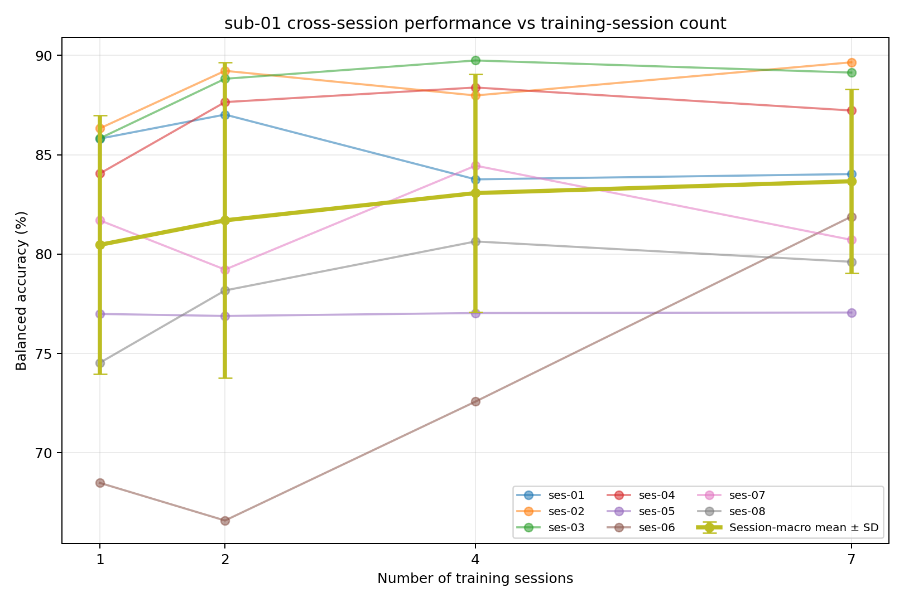

# sub-01 Training-Session-Count Cross-Session Benchmark — v2.9

## Benchmark design and safeguards

- **Every fold holds one session out completely.** The held-out test session is absent from every corresponding `train_list.csv` and from all pooled training trials. This exclusion was programmatically checked across all 240 runs.
- **Configuration was frozen before the benchmark began.** No hyperparameter was changed after viewing a benchmark result.
- **Session combinations were selected without using performance.** For each held-out session, all legal combinations were enumerated. Three combinations for training sizes 1, 2, and 4 were selected in advance with deterministic selection seed `20260712`. The only legal seven-session combination was used for size 7.
- **Model seeds:** `42`, `123`, and `2026` were run. Because both balancing options were `none`, the current pipeline was deterministic across these seeds: the maximum balanced-accuracy range across seeds for an identical train combination was **0.000000 percentage points**.
- **Source commit for every fold:** `25047c459adb0205705cd17abc37bdd952343e45`. The commit SHA is also stored in every row of `all_runs.csv`, `session_level_summary.csv`, and `macro_summary.csv`.

## Frozen configuration

| Setting | Value |
|---|---|
| Pipeline | `bci_pipeline_v2.9.py` |
| Training mode | Equivalent cached execution of the pipeline's `train_multi` trial-pooling path; preprocessing was performed independently per recording and only epoched command trials were pooled |
| Channels | `motor3` — C3, Cz, C4 |
| Channel normalization | Per-recording/channel `zscore` |
| Selected features | 25 |
| LDA shrinkage | 0.1 |
| Confidence threshold | 0.45 |
| IDLE distance threshold | 999 |
| Class / subject balancing | `none` / `none` |
| Window / step | 3.0 s / 0.25 s |
| Event overlap threshold | 0.5 |
| Temporal smoothing | Centered majority vote, window 5 |

> **Non-causal smoothing:** smoothing window 5 is centered and therefore uses future neighboring windows. It is not a causal or real-time result.

## Session-macro results

The primary summaries below are computed in two stages: first, runs are averaged within each held-out session and training-session count across combinations and seeds; second, those eight held-out-session means are averaged. Therefore, the macro values are **session-level macro summaries**, not pooled-window metrics.

| Training sessions | Runs | Session-macro accuracy mean ± SD | Session-macro balanced accuracy mean ± SD | Macro WALK recall | Macro STOP recall | Held-out-session BA range | Collapses |
|---:|---:|---:|---:|---:|---:|---:|---:|
| 1 | 72 | **80.78% ± 7.47%** | **80.47% ± 6.51%** | 79.22% | 81.71% | 68.49%–86.33% | 3 |
| 2 | 72 | **81.47% ± 9.48%** | **81.70% ± 7.94%** | 82.63% | 80.77% | 66.59%–89.23% | 0 |
| 4 | 72 | **83.07% ± 7.07%** | **83.07% ± 6.00%** | 83.09% | 83.06% | 72.58%–89.75% | 0 |
| 7 | 24 | **84.40% ± 3.54%** | **83.67% ± 4.64%** | 80.77% | 86.56% | 77.06%–89.65% | 0 |

## Every held-out fold: class support and recall

WALK/STOP support is determined by the held-out recording and is therefore constant across combinations and seeds for a given fold. Recall values below are the mean ± SD across that fold's preselected combinations and three seeds.

| Held-out session | Train count | Runs | WALK support | WALK recall | STOP support | STOP recall | Balanced accuracy |
|---|---:|---:|---:|---:|---:|---:|---:|
| `ses-01` | 1 | 9 | 366 | 91.71% ± 2.37% | 614 | 79.91% ± 3.95% | **85.81% ± 2.55%** |
| `ses-01` | 2 | 9 | 366 | 91.53% ± 3.76% | 614 | 82.52% ± 1.52% | **87.02% ± 2.64%** |
| `ses-01` | 4 | 9 | 366 | 87.89% ± 3.08% | 614 | 79.64% ± 2.19% | **83.76% ± 2.23%** |
| `ses-01` | 7 | 3 | 366 | 89.07% ± 0.00% | 614 | 78.99% ± 0.00% | **84.03% ± 0.00%** |
| `ses-02` | 1 | 9 | 366 | 83.52% ± 5.72% | 614 | 89.14% ± 1.69% | **86.33% ± 2.60%** |
| `ses-02` | 2 | 9 | 366 | 89.53% ± 4.05% | 614 | 88.93% ± 1.02% | **89.23% ± 2.39%** |
| `ses-02` | 4 | 9 | 366 | 89.44% ± 0.83% | 614 | 86.54% ± 3.09% | **87.99% ± 1.66%** |
| `ses-02` | 7 | 3 | 366 | 90.71% ± 0.00% | 614 | 88.60% ± 0.00% | **89.65% ± 0.00%** |
| `ses-03` | 1 | 9 | 366 | 82.24% ± 11.50% | 614 | 89.41% ± 4.66% | **85.83% ± 4.66%** |
| `ses-03` | 2 | 9 | 366 | 94.54% ± 0.85% | 614 | 83.12% ± 2.93% | **88.83% ± 1.50%** |
| `ses-03` | 4 | 9 | 366 | 91.44% ± 0.96% | 614 | 88.06% ± 1.14% | **89.75% ± 0.69%** |
| `ses-03` | 7 | 3 | 366 | 90.16% ± 0.00% | 614 | 88.11% ± 0.00% | **89.14% ± 0.00%** |
| `ses-04` | 1 | 9 | 366 | 85.70% ± 6.22% | 614 | 82.41% ± 9.37% | **84.06% ± 2.03%** |
| `ses-04` | 2 | 9 | 366 | 90.07% ± 7.42% | 614 | 85.23% ± 3.17% | **87.65% ± 2.68%** |
| `ses-04` | 4 | 9 | 366 | 87.52% ± 1.71% | 614 | 89.25% ± 0.49% | **88.39% ± 0.78%** |
| `ses-04` | 7 | 3 | 366 | 87.98% ± 0.00% | 614 | 86.48% ± 0.00% | **87.23% ± 0.00%** |
| `ses-05` | 1 | 9 | 366 | 61.48% ± 1.44% | 614 | 92.51% ± 4.39% | **76.99% ± 2.87%** |
| `ses-05` | 2 | 9 | 366 | 60.56% ± 6.67% | 614 | 93.21% ± 4.19% | **76.89% ± 3.36%** |
| `ses-05` | 4 | 9 | 366 | 61.57% ± 3.26% | 614 | 92.51% ± 5.15% | **77.04% ± 0.95%** |
| `ses-05` | 7 | 3 | 366 | 58.20% ± 0.00% | 614 | 95.93% ± 0.00% | **77.06% ± 0.00%** |
| `ses-06` | 1 | 9 | 366 | 87.52% ± 7.04% | 614 | 49.46% ± 28.71% | **68.49% ± 11.10%** |
| `ses-06` | 2 | 9 | 366 | 94.54% ± 3.94% | 614 | 38.65% ± 24.09% | **66.59% ± 10.11%** |
| `ses-06` | 4 | 9 | 366 | 93.81% ± 2.07% | 614 | 51.36% ± 13.45% | **72.58% ± 6.13%** |
| `ses-06` | 7 | 3 | 366 | 90.16% ± 0.00% | 614 | 73.62% ± 0.00% | **81.89% ± 0.00%** |
| `ses-07` | 1 | 9 | 366 | 85.61% ± 4.59% | 614 | 77.80% ± 6.07% | **81.70% ± 0.95%** |
| `ses-07` | 2 | 9 | 366 | 77.23% ± 13.89% | 614 | 81.22% ± 11.81% | **79.22% ± 2.16%** |
| `ses-07` | 4 | 9 | 366 | 82.97% ± 6.19% | 614 | 85.94% ± 2.06% | **84.45% ± 2.07%** |
| `ses-07` | 7 | 3 | 366 | 72.68% ± 0.00% | 614 | 88.76% ± 0.00% | **80.72% ± 0.00%** |
| `ses-08` | 1 | 9 | 366 | 56.01% ± 14.27% | 614 | 93.05% ± 1.86% | **74.53% ± 6.37%** |
| `ses-08` | 2 | 9 | 366 | 63.02% ± 8.90% | 614 | 93.32% ± 0.61% | **78.17% ± 4.23%** |
| `ses-08` | 4 | 9 | 366 | 70.13% ± 12.11% | 614 | 91.15% ± 2.33% | **80.64% ± 4.91%** |
| `ses-08` | 7 | 3 | 366 | 67.21% ± 0.00% | 614 | 92.02% ± 0.00% | **79.62% ± 0.00%** |

## Statistical and deployment scope

- Sliding windows overlap heavily: each 3.0-second window advances by 0.25 seconds. Adjacent windows share most EEG samples and are **not independent observations**.
- Reported SD values across held-out sessions describe session-to-session variation; they are not confidence intervals based on independent windows.
- `idle_distance_threshold=999` effectively disables the IDLE gate. The benchmark evaluates labelled WALK/STOP periods and does **not** evaluate IDLE/background rejection, background false activations, or three-class continuous-control performance.
- This is same-subject cross-session testing on `sub-01`; it is not cross-subject validation.
- Combination averaging reduces dependence on one hand-picked training subset, but the dataset still contains only eight sessions from one subject.

## Files

- `BENCHMARK_MANIFEST.json`: frozen protocol and every preselected train/test specification.
- `all_runs.csv`: all 240 individual runs, including commit SHA, sessions, seed, supports, recalls, and metrics.
- `session_level_summary.csv`: combination/seed means within each held-out session.
- `macro_summary.csv`: session-level macro summaries used in the main table and graph.
- `seed_invariance.csv`: seed sensitivity for every exact session combination.
- `holdout_ses-XX/...`: per-run train lists and timeline metrics.
